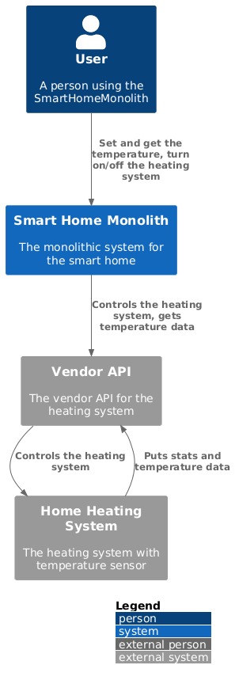
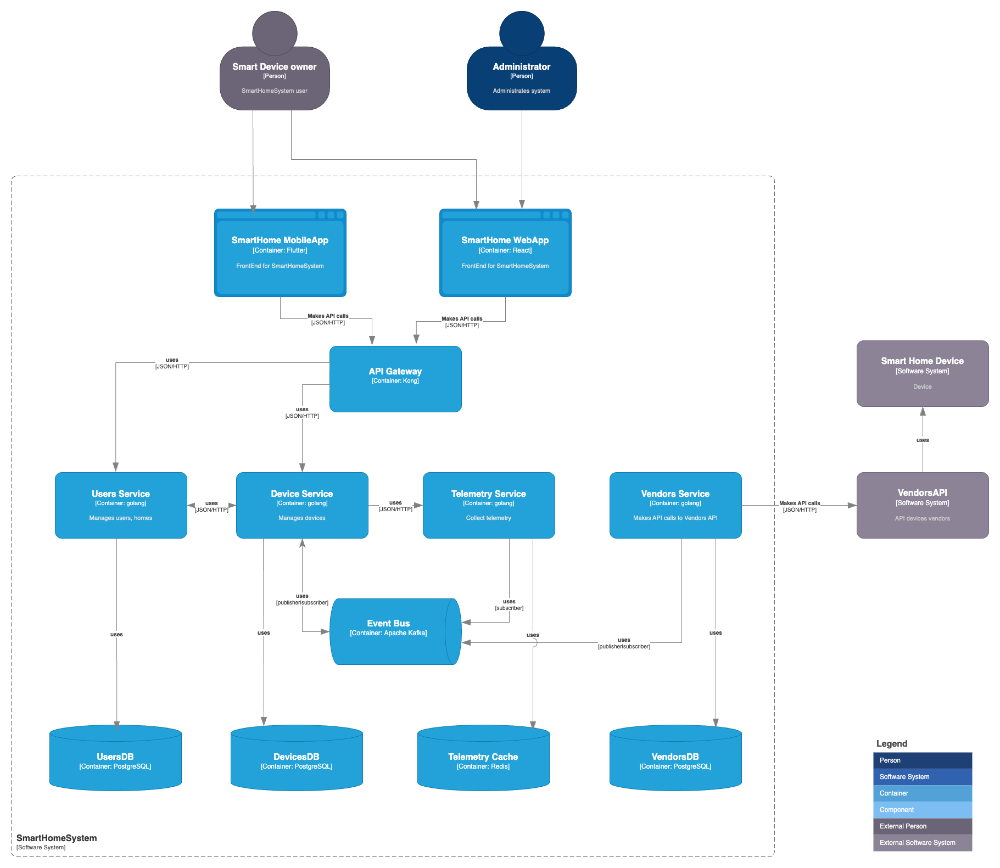
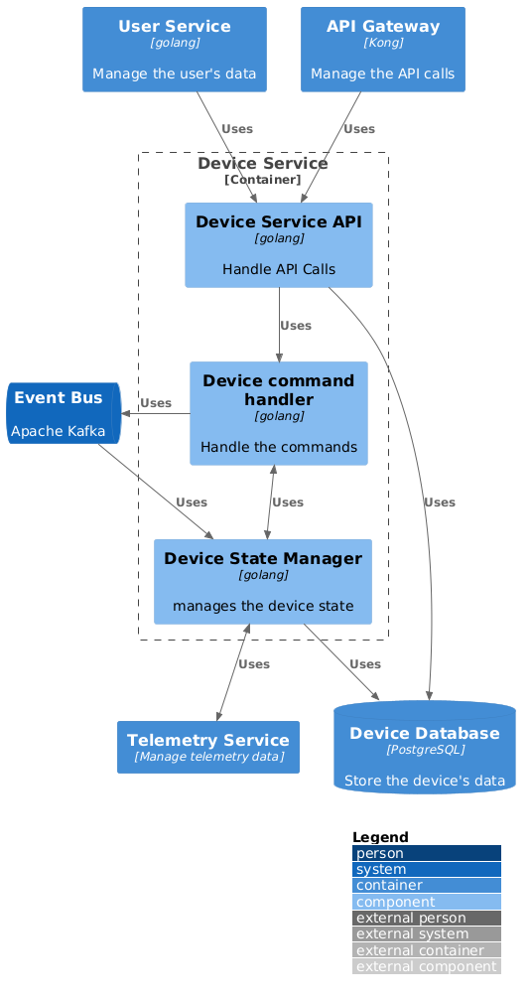
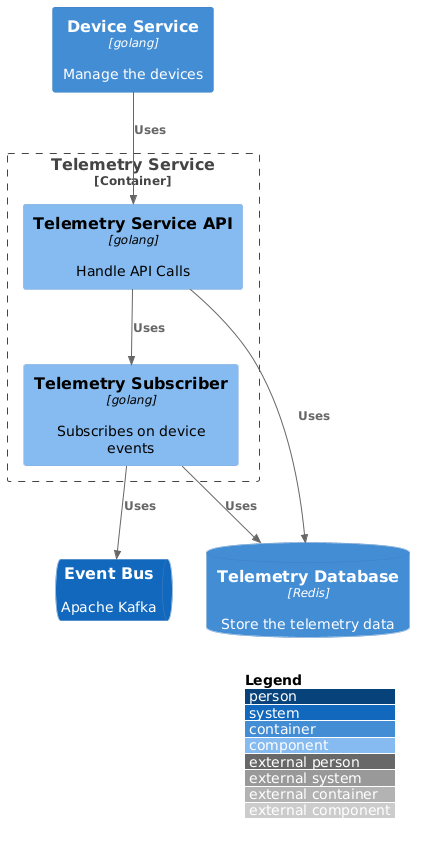
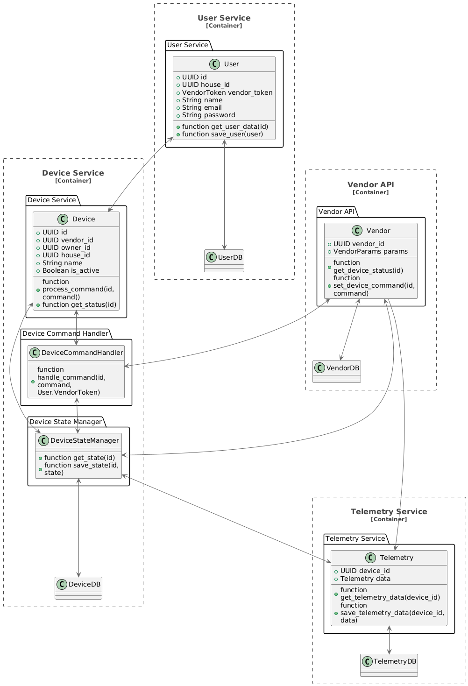
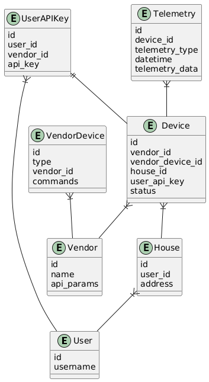

# Sprint 3
## Анализ и планирование

### Функциональность исходного монолита

Пользователи API могут:
 - удаленно включать/выключать отопление 
 - устанавливать желаемую температуру 
 - просматривать текущую температуру
 - автоматически управлять отоплением в зависимости от текущей температуры и желаемой температуры (coming soon, see developer's comment: // TODO: Implement automatic temperature maintenance logic in the service layer )

### Архитектура исходного монолита

 - Язык программирования: Java
 - База данных: PostgreSQL 
 - Архитектура: Monolith 
 - Взаимодействие с пользователем: HTTP, запросы обрабатываются синхронно
 - Взаимодействие с VendorAPI: отсутствует документация
 - Масштабируемость: вертикальная 
 - Развертывание: виртуальная машина, остановка для обслуживания

### Домены и границы контекстов

 - Домен: Управление устройствами
   - контекст: Управление отоплением - включение и выключение отопления
   - контекст: Управление температурой - установка желаемой температуры
 - Домен: Мониторинг температуры
   - контекст: Обработка телеметрии с датчика температуры - получение текущей температуры

### Анализ проблем монолита
 - Ограниченный функционал (нет возможности добавить новые устройства через API, нет автоматического поддержания температуры)
 - Низкие масштабируемость, отказоустойчивость и скорость разработки
 - Зависимость от VendorAPI так как отсутствует собственное производство устройств

### Диаграмма контекста

файл: [monolith-context.puml](./schemas/monolith-context.puml)

## Проектирование микросервисной архитектуры

### Разделение на микросервисы

 - Управление устройствами
 - Управление пользователями и домами
 - Управление вызовами внешних API
 - Мониторинг устройств

### Диаграмма контейнеров
Файл в формате documentation-as-code: [microservices-containers.puml](./schemas/microservices-containers.puml)
(при рендеринге выглядит отвратительно, но в PlantUML работает)

Более щадащая глаза схема (подготовлена в draw.io):

### Диаграмма компонентов

Компонент управления устройствами

Компонент телеметрии

### Диаграмма кода

ER-диаграмма данных

## API взаисодействия микросервисов

### Управление устройствами

 [Sync API](./api/openapi/device-service.yaml)

 [Async API](./api/asyncapi/device-service-async.yaml)

### Управление телеметрией

 [Sync API](./api/openapi/telemetry-service.yaml)

 [Async API](./api/asyncapi/telemetry-service-async.yaml)

### Необязательные задания не выполнялись

